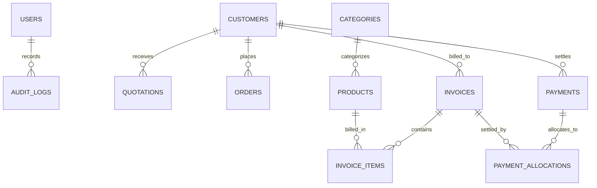

# RAIS Agencies — Database Schema & Data Dictionary

## 1. Relational Entity Schema

## 2. Table Specifications

### 2.1 `users`
Stores system operators and administrators with role-based access limits.
- `id`: UUID (Primary Key)
- `username`: VARCHAR(50) (Unique, Indexed)
- `email`: VARCHAR(100) (Unique, Indexed)
- `full_name`: VARCHAR(100)
- `password_hash`: VARCHAR(255) (Bcrypt hashed)
- `role`: VARCHAR(20) (`ADMIN`, `OPERATOR`, `VIEWER`)
- `is_active`: BOOLEAN
- `created_at`, `updated_at`: TIMESTAMP UTC

### 2.2 `customers`
B2B restaurant and commercial accounts.
- `id`: UUID (Primary Key)
- `customer_code`: VARCHAR(20) (Unique, e.g. `CUST-0001`)
- `business_name`: VARCHAR(150) (Indexed)
- `contact_person`: VARCHAR(100)
- `phone`: VARCHAR(20) (Indexed)
- `secondary_phone`: VARCHAR(20)
- `email`: VARCHAR(100)
- `address_line1`, `address_line2`: VARCHAR(255)
- `city`: VARCHAR(100) (Default: "Rayachoty")
- `state`: VARCHAR(100) (Default: "Andhra Pradesh")
- `pincode`: VARCHAR(20) (Default: "516269")
- `gstin`: VARCHAR(20)
- `credit_limit`: NUMERIC(12,2)
- `status`: VARCHAR(20) (`ACTIVE`, `INACTIVE`, `SUSPENDED`)
- `notes`: TEXT

### 2.3 `categories` & `products`
The authoritative product and service catalogue layer.
- `categories`: `id`, `code` (Unique), `name`, `description`, `display_order`, `is_active`.
- `products`: `id`, `sku` (Unique), `category_id` (FK), `name`, `brand`, `packaging_unit`, `unit_quantity`, `base_price` (Wholesale ₹), `tax_rate` (GST %), `hsn_code`, `current_stock`, `min_stock_alert`, `is_active`.

### 2.4 `invoices` & `invoice_items`
Deterministic financial invoices and line items.
- `invoices`: `id`, `invoice_number` (Unique, e.g. `INV-202608-00001`), `customer_id` (FK), `status` (`DRAFT`, `ISSUED`, `PARTIALLY_PAID`, `PAID`, `OVERDUE`, `CANCELLED`, `VOID`), `invoice_date`, `due_date`, `subtotal`, `discount_amount`, `taxable_amount`, `tax_amount`, `total_amount`, `paid_amount`, `outstanding_amount`, `payment_terms`, `notes`, `qr_payload`.
- `invoice_items`: `id`, `invoice_id` (FK), `product_id` (FK), `item_description`, `brand`, `packaging_unit`, `hsn_code`, `quantity`, `unit_price`, `discount_rate`, `discount_amount`, `taxable_amount`, `tax_rate`, `tax_amount`, `line_total`.

### 2.5 `payments` & `payment_allocations`
Financial settlements and invoice reconciliation.
- `payments`: `id`, `payment_number` (Unique, e.g. `PAY-202608-00001`), `customer_id` (FK), `payment_date`, `amount`, `allocated_amount`, `unallocated_amount`, `payment_method` (`CASH`, `UPI`, `NEFT_RTGS`, `CHEQUE`, `CARD`), `reference_number`, `notes`.
- `payment_allocations`: `id`, `payment_id` (FK), `invoice_id` (FK), `allocated_amount`, `allocated_at`.

### 2.6 `audit_logs`
Immutable audit trail.
- `id`: UUID, `user_id`, `username`, `user_role`, `entity_name`, `entity_id`, `action`, `before_state`, `after_state`, `ip_address`, `created_at`.
